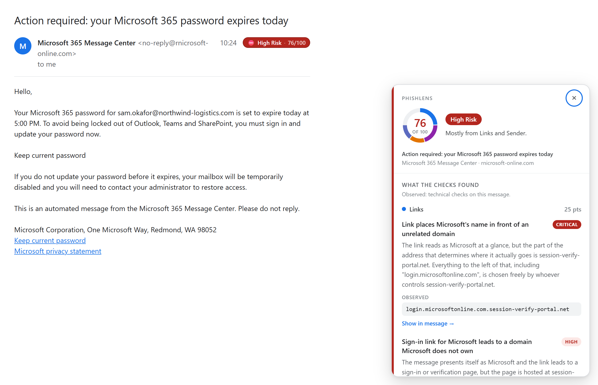
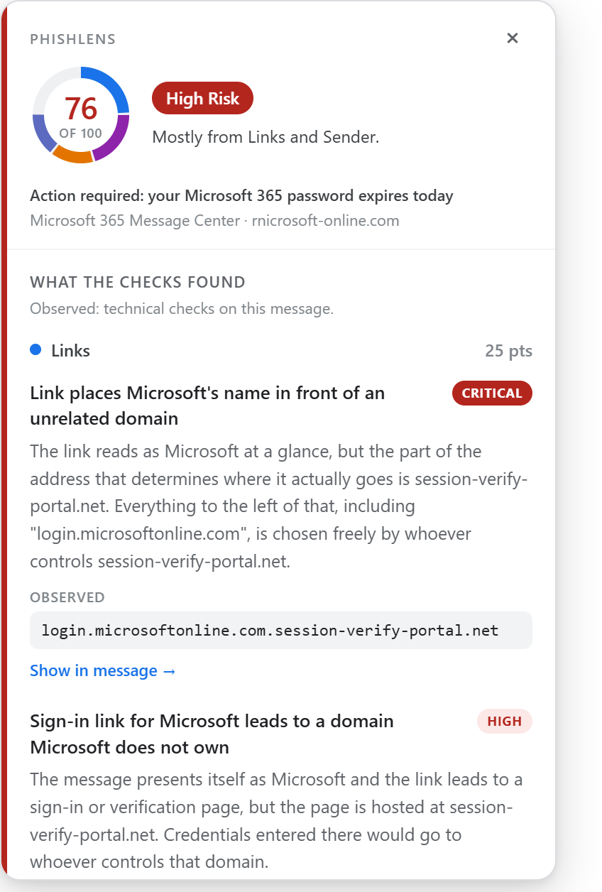
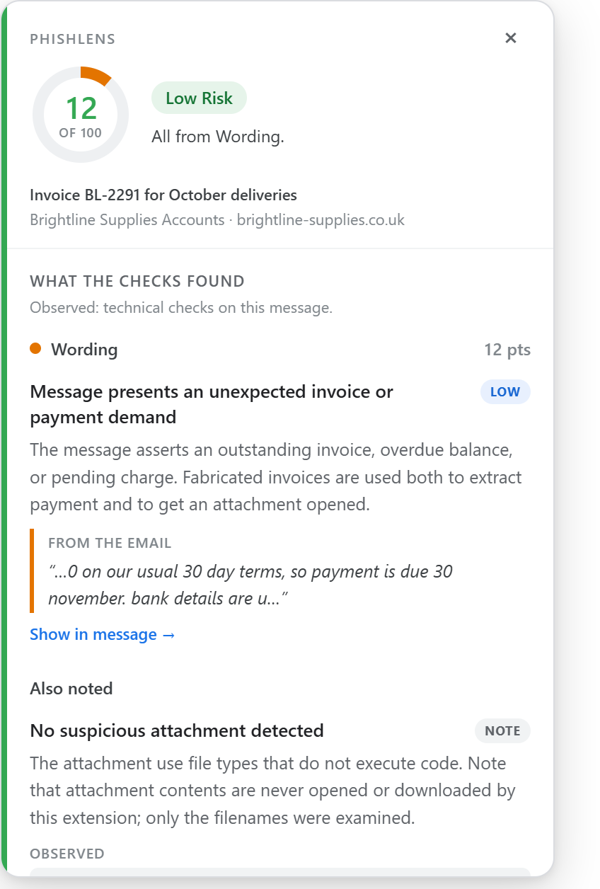
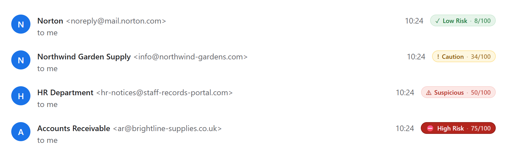
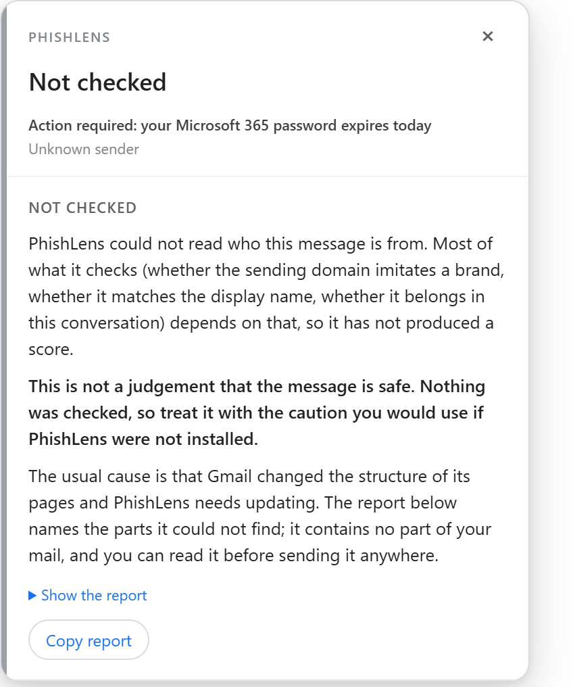
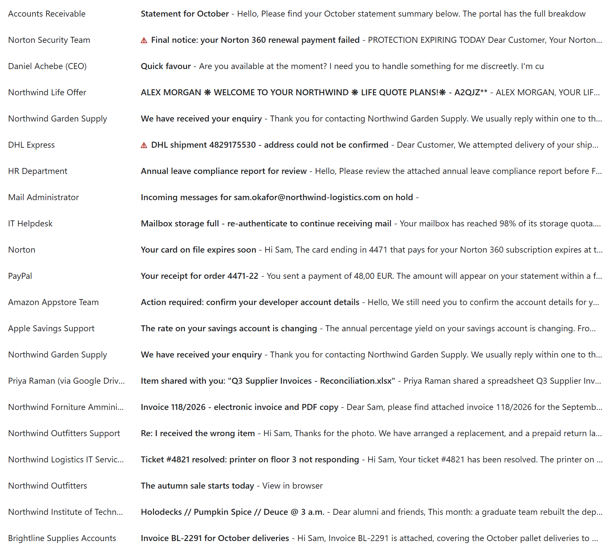

<div align="center">


<h1>PhishLens</h1>

**A second look before you click.**

Spot signs of phishing in Gmail, with explanations you can check for yourself.

<a href="https://github.com/nilayk/PhishLens/releases/latest"></a>


<a href="LICENSE"></a>

[Install](#install) · [What the badge means](#what-the-badge-means) ·
[Privacy](#your-mail-stays-yours) · [Settings](#make-it-work-for-you) ·
[Help](#help-and-limitations)



</div>

PhishLens is a free, open-source Chrome extension that adds a risk badge to the email you are reading.
Click it to see what looks unusual, why it matters, and the evidence behind the score. Analysis runs on
your computer by default. No PhishLens account or API key is required.

> [!IMPORTANT]
> PhishLens is a reading aid. It does not block links, downloads, or replies, and a low score does not
> guarantee that a message is safe.

## See what deserves a closer look

A familiar name can hide an unfamiliar address. A convincing link can lead somewhere else. PhishLens
brings those details into view while you read.

| It looks at | And tells you about |
| :--- | :--- |
| **The sender** | Lookalike domains, misleading display names, and replies that imitate someone already in the conversation. |
| **The links** | Where a link's visible text and its destination disagree, or a trusted name sits in front of an unrelated address. |
| **The request** | Verification codes, payment and bank-detail changes, gift cards, and pressure to act quickly. |
| **The attachments** | Executable files and disguised extensions, flagged from the filename without opening or downloading anything. |
| **Its own reasoning** | Every finding, the evidence behind it, and the arithmetic of the score. Hover a finding to highlight the part of the message it came from. |

## Quiet on ordinary mail

A checker that flags everything gets switched off, so most of the work goes into what PhishLens *does not*
say. Both of these cards are the real component, rendered from the test fixtures:

<table>
<tr>
<td width="50%" valign="top">

<picture>
  <source media="(prefers-color-scheme: dark)" srcset="docs/assets/card-dark.png">
  
</picture>

**A brand imitation, 76/100.** The sending domain is a near-identical
imitation, and the link reads as Microsoft while going somewhere else.
Both findings name the evidence, so you can check them yourself.

</td>
<td width="50%" valign="top">

<picture>
  <source media="(prefers-color-scheme: dark)" srcset="docs/assets/card-low-dark.png">
  
</picture>

**An ordinary supplier invoice, 12/100.** The same checks run, and the
one note they raise stays a note. Ordinary mail is the common case and
is what the scoring is tuned against.

</td>
</tr>
</table>

## Install

**For Gmail in desktop Chrome 120 or later.** PhishLens does not run in the Gmail mobile apps or other
email clients.

1. Open the **[latest release](https://github.com/nilayk/PhishLens/releases/latest)** and download
   `phishlens-<version>.zip` under **Assets**. Choose the extension ZIP, not GitHub's **Source code**
   downloads.
2. Unzip it into a folder you will keep on your computer.
3. Enter `chrome://extensions` in Chrome's address bar and turn on **Developer mode**.
4. Click **Load unpacked** and select the extracted folder containing `manifest.json`.
5. Open or refresh Gmail, then open a received message. Look for the badge beside the sender, and
   the score on the PhishLens toolbar icon, coloured by the same risk band.

No model setup is needed to use the core checks. Pin PhishLens from Chrome's Extensions menu for quick
access to its status and settings.

<details>
<summary><strong>Updating a manual installation</strong></summary>

Download and extract the newer release into the same extension folder, then click **Reload** on PhishLens
at `chrome://extensions` and refresh Gmail. Manual installations do not update automatically from GitHub.

</details>

<details>
<summary><strong>Building from source instead</strong></summary>

```bash
npm install
npm run build     # unpacked extension in dist/, ready for "Load unpacked"
npm run verify    # lint, typecheck, test, build, distribution check
```

The [development guide](docs/DEVELOPMENT.md) covers the project layout, the UI harness, and releases.
Published downloads can lag behind the source on this page; check the
[release notes](https://github.com/nilayk/PhishLens/releases) for the version you install.

</details>

## What the badge means

The score appears beside the sender and on the toolbar icon for the Gmail tab. Both use the same
bands and colours; hiding low-risk badges in Settings clears the toolbar number too.

The score summarises the evidence PhishLens found. It is not a percentage chance that the message is
phishing.

| Badge | Score | How to read it |
| :--- | :--- | :--- |
| ✓ **Low Risk** | 0–24 | Few or no warning signs in the available evidence. This is not an all-clear. |
| ! **Caution** | 25–49 | Some details deserve a closer look. Open the badge to see why. |
| ⚠ **Suspicious** | 50–74 | Significant warning signs. Verify the request through a known contact or website before acting. |
| ⛔ **High Risk** | 75–100 | Strong warning signs. Avoid using the message's links or attachments to follow up. |
| ? **Not checked** | None | PhishLens could not read enough to assess the message. This is not a judgement of safety. |



<details>
<summary><strong>What "Not checked" looks like, and why it exists</strong></summary>



Gmail changes its markup from time to time. When a part of the message PhishLens depends on cannot be
found, it says so instead of scoring what it managed to read. A confident **Low Risk** on a message
nobody checked is the one failure this project will not ship. The card offers a report naming the parts it
could not find, which contains no part of your mail and which you can read before sending it anywhere.

</details>

## Your mail stays yours

An extension that reads email should be clear about what it does with it.

- **No uploads by default.** PhishLens analyses messages in the browser and makes no network requests in
  its default configuration.
- **No account, analytics, or telemetry.** There is no PhishLens service collecting your reading activity.
- **No saved email archive.** Message content is not written to persistent storage. Analysis results may
  remain in memory until the tab closes. Your settings, and any addresses or domains you choose to trust,
  are saved using Chrome's storage.
- **Nothing in a message is opened.** PhishLens does not visit links, fetch images, or open attachments to
  inspect them. Every check reads the text and filenames Gmail already displays.
- **Two permissions.** Installing grants access to Gmail and to storage for your settings. An optional
  model-server connection asks separately, for the one address you configure.

> [!NOTE]
> If you choose to connect a model server, PhishLens sends that server the sender's display name, the
> subject, and an excerpt of the body. A remote server receives that content over the network. This is an
> explicit setting, never the default.

[Read the full privacy and security details →](docs/PRIVACY.md)

## Make it work for you

Open **PhishLens in the Chrome toolbar → Settings** to adjust its behaviour.

**Keep the inbox quieter.** Hide low-risk badges, or turn on optional sender warnings in the message list.
List warnings check sender identity only (there is no body, no links and no authentication result to read
from a list), so an unmarked row means nothing was visible, not that the message is safe.



**Manage trusted senders.** For eligible messages the card offers to trust an address or domain. Trust can
soften findings about *wording* while Gmail confirms the sender really is who they claim, and never
silences a finding about identity, links, or attachments. Nothing is hidden, and one click undoes it.

**Use optional AI.** AI is off until you turn it on. Where Chrome makes an on-device model available, it
can add an assessment of the wording. When you choose it on the welcome page, PhishLens checks whether
Chrome's model is ready and, if it is not, shows how to switch it on in `chrome://settings/system`. The core
checks work without it, and the model is capped: it cannot remove their findings or raise a score that the
checks do not already support. Advanced users can point PhishLens at their own model server.
[AI availability and setup →](docs/LOCAL-AI.md)

To save time and battery, the AI is only asked about messages where a check has already found something,
since on other mail its view could not change the score. The card says when it was not asked and offers
a button to ask anyway, and a setting turns this off. The bottom of the card shows how long the checks and
the AI took.

## Help and limitations

<details>
<summary><strong>No badge appears</strong></summary>

Refresh Gmail after installing, and open a message you received; your own outgoing replies are not
assessed. Low-risk badges may be switched off in your settings. Click the toolbar icon to see what
PhishLens thinks it is doing on the current tab.

</details>

<details>
<summary><strong>A result looks wrong, or says "Not checked"</strong></summary>

The toolbar popup and the explanation card can both produce a diagnostic report.
[Open an issue](https://github.com/nilayk/PhishLens/issues) with your extension version, what you
expected, and what you saw. Read anything you attach first and remove private content: message text,
addresses, links, and screenshots of real correspondence.

</details>

PhishLens can miss phishing, and it can flag legitimate mail. It reads what Gmail displays, so a change to
Gmail's layout can stop a check finding anything until the extension is updated. The wording checks cover
English plus Spanish, French, German, Portuguese, Italian, Dutch, Hindi and Hinglish; the sender, link and
filename checks help in any language. It does not open attachments, and it consults no blocklists or
reputation services. Everything it knows comes from the message in front of it.

## Open source

| Document | What is in it |
| :--- | :--- |
| [Detection and scoring](docs/DETECTION.md) | Every category of check, how the 0–100 score is assembled, and how false positives are held down. |
| [Privacy and security](docs/PRIVACY.md) | Permissions, exactly what data exists and where, and the threat model. |
| [Local AI](docs/LOCAL-AI.md) | The on-device model, connecting your own, and what a model is allowed to do. |
| [Development](docs/DEVELOPMENT.md) | Building, testing, the UI harness, project layout, and releases. |
| [Architecture](docs/ARCHITECTURE.md) | Short map of where code runs and where to change what. |
| [Design decisions](docs/adr/) | Why not the obvious alternative (ADRs). |

Bug reports about missed phishing or false alarms are the most useful thing you can send, and a failing
fixture in `test/fixtures/` is better still. Use invented examples rather than anyone's real mail, and run
`npm run verify` before opening a pull request.

<div align="center">

**MIT licensed.** An independent project, not affiliated with or endorsed by Google.

</div>
