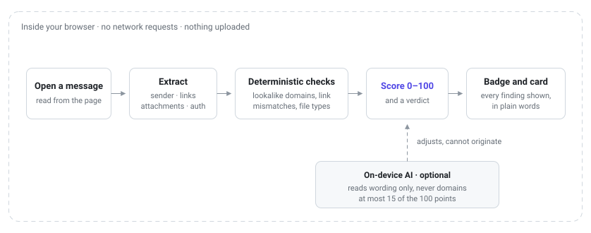

# Detection and scoring

How a message becomes a 0–100 score. Design history:
[ARCHITECTURE.md](ARCHITECTURE.md) and [adr/](adr/) (especially
[0004](adr/0004-scoring-floors-and-weights.md),
[0005](adr/0005-false-positive-resistance.md)).

## Principle

> Use deterministic checks for what a computer can know; use a language model only for intent and tone.

Facts (lookalike domains, mismatched links, executable filenames) are decided in code. Readings of
wording may use a model, capped so they cannot reverse a check. Separate detectors, a separate scoring
category, and a separate card section keep the two apart.

## What is checked

Detectors live under `src/analysis/rules/`. Each emits `SecuritySignal`s (id, category, severity,
explanation, evidence); none computes the final score.

| Category | File | Looks for |
| --- | --- | --- |
| Identity | `identity.ts`, `thread.ts` | Lookalikes, homoglyphs, brand-in-wrong-place, display names that do not match the domain, display names claiming the reader's own organisation from outside it, reply-chain impersonation |
| Links | `links.ts` | Anchor ≠ destination, brand-prefix hosts, IPs, punycode, shorteners, credential wording to unrelated hosts, public object-storage pages, filenames that link to someone else's web page, a stranger's link echoed by a web form's autoresponder, on every host a click passes through |
| Content | `content.ts`, `languages/` | Credential asks, OTP solicitation, payment changes, gift cards, urgency, secrecy, process bypass, … |
| Attachments | `attachments.ts` | Executables, macros, archives, double extensions, RTLO tricks (filename only) |
| Authentication | `authentication.ts` | SPF/DKIM/DMARC and Gmail’s warning as shown in the page; no raw headers |

**Wording languages.** English patterns always run. Packs add patterns to the **same themes** for Spanish,
French, German, Portuguese, Italian, Dutch, Hindi and Hinglish (gated detection; per-language negation and
bulk vocabulary). Details: `src/analysis/rules/languages/`.

**Redirects add hosts; they never replace one.** A redirect parameter is decoded textually (up to three
hops) and each host on the path is judged, the entry host first, since it is the one an attacker cannot
dress up. Host-identity rules (lookalike, IP, punycode, brand prefix, shortener, deep subdomains) run on
every hop; rules about the page itself (sign-in wording, open storage, a prose anchor naming a brand) run
on the decoded destination. A displayed brand address reached through somebody else's redirector is
`high`. Known click trackers are matched on their own host and click path (`google.com` only for
`/url`), and excuse only their own hop: what they forward to is judged like anything else, and only a
tracker whose target cannot be decoded leaves nothing to judge. A tracker's owner publishing pages
(`docs.google.com`, `sites.google.com`, `*.substack.com`, `hs-sites.com`, `ghost.io`) is not a tracker; the
publishable ones are open hosting, where brand ownership of the domain says nothing about the page.
A destination a link-protection gateway carries base64-encoded is found by its content (`aHR0c` is
`http` encoded) in a path segment or a parameter, and kept only if it decodes to a web URL; no vendor's
layout is listed.

**What counts as the message.** Quoted replies are left out of the wording checks so a thread is not
re-judged on what earlier messages said, but a quote is only a class name, which a sender can write, so
two things do not depend on it. Every link is read, quoted or not, and a body with nothing outside its
quotes (a bare forward, or a lure wrapped in a fake quote) is read from the quotes. Text hidden with
`font-size: 0`, `visibility: hidden`, `display: none`, off-screen positioning or near-zero opacity is
removed before scoring and reported once it is long enough to matter; clipping only counts when the
shape is unambiguously empty, so a rectangle starting at zero does not erase visible content; a child escapes a hidden container
only with an absolute size or its own `visibility: visible`, and the container's own text stays hidden.

**OTP vs code delivery.** Asking the reader to share a one-time code is the attack; delivering a code is
ordinary mail. Rules key on solicitation verbs, and a surrounding negation (“never share…”, including
after-verb forms in other languages) reverses a match. Conditionals like “if you do not send…” stay
reportable. “Enter the code” is the delivery's own instruction, so it counts only when the message
carries no code beside the word naming it (“code: 482 910”); a number elsewhere in it does not count as
one. Fixtures: `legitimate-verification-code`, `northwind-*-verification-code`.

**Echoed web forms.** A spammer can type a lure into any company's contact form with the reader's
address in the email field, and the company's autoresponder delivers it: genuine sender, passing
authentication, nobody's brand. `link.echoed_form_link` recognises the shape instead. The reader's own
address (plus-tags and Gmail's dots ignored) must be the whole value of a `label: value` line among at
least three, no outside address may be another field's value (a quoted From/To header block), and a link
to neither the sender's domain nor the reader's must sit inside free text of at least 40 letters, so a
"Tracking:" or "Website:" URL does not count. `medium` with no floor, because a reader who filled in the
form and pasted a link gets the same message; the finding says how to tell. Fixtures: `echoed-form-lure`,
`legitimate-contact-form-confirmation`.

## The score

Every weight, ceiling, floor and band threshold lives in `src/analysis/scoring/config.ts`.

| Category | Weight |
| --- | --- |
| Links | 25 |
| Identity | 21 |
| Content | 15 |
| Semantic (AI) | 15 |
| Authentication | 14 |
| Attachments | 10 |

Aggregation (`scoring/aggregate.ts`):

1. Cap each finding by severity (`info` 5 … `critical` 100).
2. Sum per category; cap at the category weight.
3. Sum categories; clamp to `[0, 100]`.
4. **Floors (deterministic only):** one `high` → ≥50; one `critical` → ≥75; `high` in two or more
   categories → ≥75. Never from `llm` or `authentication.gmail_warning`.

Bands: low &lt; 25 ≤ caution &lt; 50 ≤ suspicious &lt; 75 ≤ high-risk.

Floors exist so single-dimension attacks (plain-text gift-card BEC) cannot top out at the content weight
alone. Legitimate fixtures must not produce `high`/`critical` deterministic findings; that assumption is
tested.

## Holding down false positives

Full reasoning: [adr/0005](adr/0005-false-positive-resistance.md). In short:

- **Dampening**: soften `content` when a claimed brand’s domain is proven by Gmail and every link host
  stays inside it; never dampen identity/link; never high/critical. The one exception is the fake-page
  combinations (`DAMPENING.refutableCombinations`: urgent or threatened sign-in, billing update under
  threat), which a verified brand with aligned links refutes and which are zeroed; money-movement
  combinations keep full weight, since a compromised genuine mailbox sends exactly those.
- **Bulk mail**: suppress marketing-prone content themes when unsubscribe language is present and there
  is no credential ask (per language). Combinations are built from the surviving themes only. A theme can
  name evidence that survives the suppression: crypto wording (an exchange's transfer-in offer) drops
  out of bulk mail, a wallet address does not. Crypto wording behind a negation ("never send bitcoin to…")
  is read as the scam warning it is.
- **Sender click-trackers**: mismatch rules skip the sender’s own domain unless the anchor impersonates a brand.
  A proven sender's link that reaches its own site through a provider's tracker is skipped the same way.
- **Displayed ordinary addresses**: a proven sender showing another ordinary address whose link lands
  on its own site is skipped. Shown through an opaque link service (one hop, no sign-in path, nothing
  decodable behind it) from a proven, non-freemail sender outside open hosting, it is `medium`; two names
  under `.gov`/`.mil` are `medium` too. A brand's address, a visible stranger destination, or an unproven
  sender keeps the `high`/`critical` finding, as do the reader's own domain on display and a subject
  asking for a sign-in.
- **Brand mentions**: a proven, non-freemail sender outside open hosting naming another brand as a bare
  label ("Follow on Instagram", a product it sells) through some other host is `medium`, not `high`; an
  action or sign-in word in the anchor, a claim to be that brand, or an unproven sender keeps it `high`.
- **Email-provider trackers**: a sender showing its own address, linked through a provider's tracker
  nobody can list, is skipped only when Gmail proves the sender, the sender is not freemail and not a
  brand in the table (whose own link hosts belong in its `domains`), and the destination neither carries
  the sender's name nor asks for a sign-in. A table brand proven as itself showing another brand's address
  through its own host (a co-marketing offer) stays reported, at `medium`; any other
  sender doing it stays `critical`, since a phisher can authenticate a domain of their own.
- **Fake attachments**: link text that is a filename ("Report-2026.pdf") opening a page on an unrelated
  host is `high`. It is passed over on the sender's own hosts, on a table brand's file service (a shared
  file is a page there by design), when the address is the named file or carries its name (a help desk's
  `/attachments/token/…?name=photo.jpeg`), and when a tracker hides the destination.
- **Lures a genuine service delivers**: a file share or signing request ("Item shared with you: …",
  "Complete with …: …") is authenticated and linked by the real service, so the item's name is the only
  part an attacker wrote. A name worded as an account alert is an identity finding, so the service's
  proven links cannot dampen it: `medium` with one alert feature (a locked state, a security event, a
  verify-now deadline), `high` with two. Money words are not alert features; genuine documents are
  called "invoice" every day.
- **Image-only mail**: a body under `minimalBodyChars` linking off-site is a `low` note; with a subject
  that asks for action (a held message, an expiring password, a payment, a shared document) it is
  `medium`, which reaches `caution` and no floor. A table brand Gmail proves is not escalated. Nothing
  reads the picture: the subject is the only text such a lure has.
- **Trust list**: same proof gate; dampens `content` only, never a high/critical finding; findings stay
  visible. Shared ticketing/tenant platforms (`zendesk.com`, `freshdesk.com`, `onmicrosoft.com`,
  `atlassian.net`) are trusted per tenant host, never as the platform.
- **Authentication**: an SPF/DKIM failure beside a DMARC pass is `low` (forwarding, mailing lists); a
  failure without one stays `high`.
- **Brand-independent identity**: shared-name / institutional checks that need no brand table.
- **The reader's own organisation**: a display name using the recipient's own domain, or its name
  beside a department ("Northwind IT Helpdesk"), from a domain outside it is `medium`, never a floor: an
  organisation's helpdesk does run on hosted services. The bare name is not enough, since a supplier's
  portal names the customer it serves. Only the domain-named form pairs with a credential request into
  the `critical` harvesting finding. Personal mailboxes have no organisation, so this never fires there.
- **Brand names that are ordinary words**: a brand named like a word or a surname (Ledger, Exodus,
  Norton) is claimed only by a product name or by being the whole display name. In link text, a name
  under six letters must be a whole word, since folding joins words up ("a vast range" is not Avast).
- **Headlines that name a brand**: link text longer than three words that mentions a brand in passing
  ("Norway cancels Microsoft contract") is a newsletter headline, not a label, unless it asks for an
  action ("view", "update", "sign in", "get started") or the message presents itself as that brand.
- **Account threats**: termination, deactivation and deletion count only as “your account will be / has
  been …”; in a looser window those words fill mailing-list footers and admin notices.

## List rows

Inbox marks use an allowlist of sender-only identity rules; unmarked means unchecked, never “looks fine.”
See [adr/0007](adr/0007-list-row-sender-only.md).

## Limitations

- Brand and public-suffix tables are curated subsets.
- No raw mail headers; authentication is best-effort from Gmail’s UI.
- Body is `textContent` only (no OCR), with a line break at every block element so that adjacent cells
  and paragraphs do not fuse into one word. A block that CSS makes inline still gets a break.
- Wording packs cover eight languages besides English; others lean on identity, links and attachments.
- An echoed form is only recognised when its labels end in a colon; a form laid out as a two-column table
  with bare labels is not, and its link is judged by the other link rules alone.
- No reputation feeds; analysis is textual only ([adr/0010](adr/0010-hostile-input-posture.md)).
